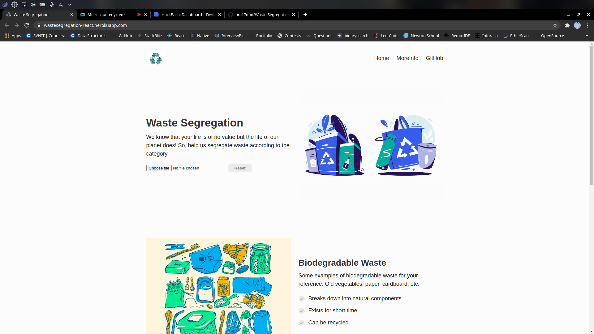
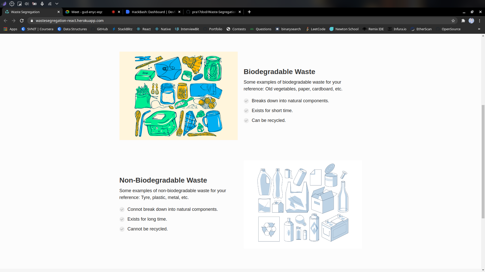
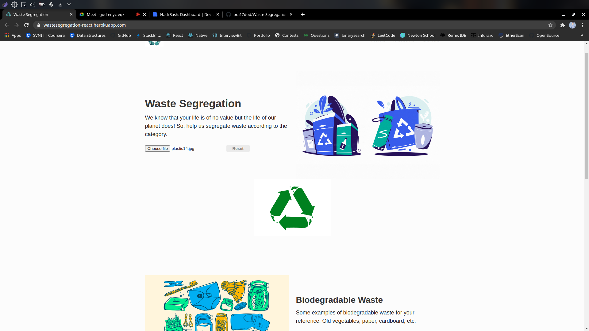
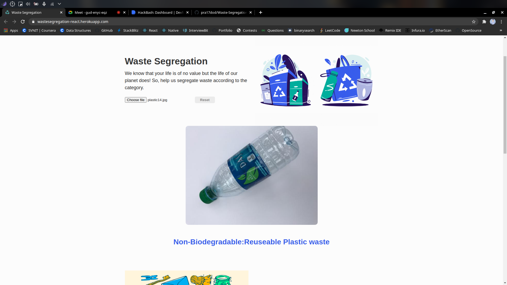

# Waste-Segregation 
## ML Based Waste Segregator

#### This Repository consists of 2 branch, ML code and backend Flask app is in flask-app branch and React.js web-app is in react-app branch. So do check both branch's readme.

#### 1. What is the definition that you are working on 
We are working on the poblem of Waste Management. We have observed that a lot cities, states and even countries faces problem on how to manage waste. Waste Management system have a golden 3R rule Recycle Reuse Reduce. But, it becomes more effecient if we include also consider the classification in Biodegradable and Non Biodegradable. As the Biodegradable waste can be used to produce biogas and various useful side products. 
    
#### 2. How are we trying to solve the problem ?
Here, we are making Deep Learning Model of Waste segregation which will identify the type of waste i.e., Biodegradable, Non-Biodegradable (Sub class: Recyclable, Resuable). This model then can be deployed at the dumping area, where the waste will be rolled on the conveyer-belt, then the Mechanic machine can segregate the waste. Since, the mechanic model is not possible in online mode, we will be deploying this model on a website, where the images of waste can be uploaded, and the model classify it.

#### 3. The Tech stack we used
Tensorflow, Flask, React.js, Heroku

#### 4. Working of our project
We have developed Machine Learning app which classify image of waste into Biodegradable and Non-Biodegradable. This app serves as backend and server for the frontend app. The frontend app is made by using React. One can upload the image of the waste, then there will be output of image with its types. Both of this apps are deployed on heroku separately and integrated with each other.
#### 5. Screenshots

 
 <ul>
     
     
  </ul>
   

   
  <ul>
     
     
  </ul>

